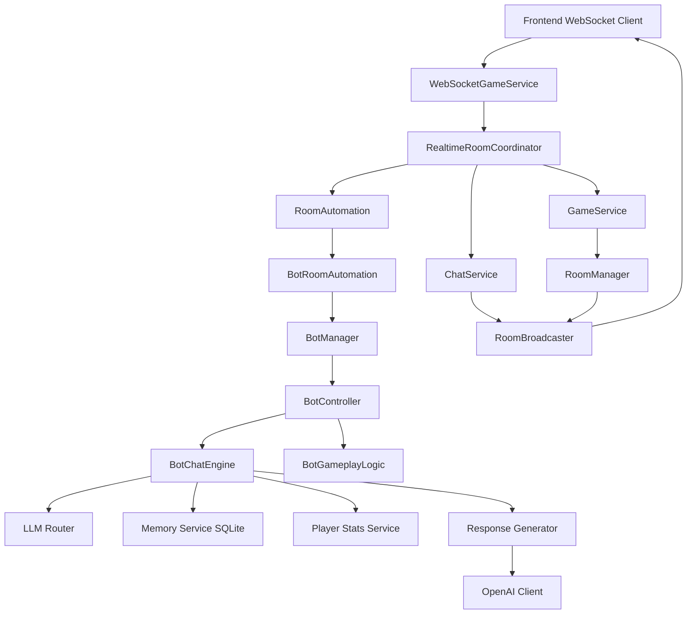

# Bot Architecture (Rough Outline)

This is a practical overview of the current realtime bot architecture in the backend.

## High-Level Modules

- `app/main.py`
  - Composition root and wiring.
  - Creates `RoomManager`, websocket services, and bot automation.
- `app/websocket/*`
  - Transport and orchestration layer for realtime events.
  - `WebSocketGameService` handles raw websocket events.
  - `RealtimeRoomCoordinator` orchestrates join/chat/round flows.
- `app/room/*`
  - Room and game state only.
  - No websocket transport logic.
- `app/bot/*`
  - Bot automation, chat routing/generation, gameplay tapping, and memory/stats integration.

## Runtime Flow (Chat)

1. Frontend sends websocket event (`chat_message`).
2. `WebSocketGameService` validates payload and delegates to `RealtimeRoomCoordinator`.
3. Coordinator posts user chat via `ChatService`.
4. Coordinator calls automation (`BotRoomAutomation`) with chat context.
5. `BotManager` forwards to bot controller(s).
6. `BotChatEngine`:
   - applies deterministic guardrails (spam/goodbye/privacy)
   - asks LLM router for route decision (`ignore`, `simple_reply`, `memory_reply`, etc.)
   - fetches memory only when route requires it
   - builds response context and calls response generator
   - post-processes output (humanization and safety/familiarity guards)
   - sends bot message via chat callback
   - optionally stores summarized memory

## Memory Model (Current)

- Storage: SQLite (`semantic_memories` in `bot_memory.db`)
- Retrieval: user-scoped only (by username), cosine similarity on stored embeddings.
- Current memory shaping:
  - rolling `last_seen` memory (single latest)
  - rolling `round_summary` memory (wins/losses summary vs bot)
  - contextual chat memories (e.g., interests/family/location), not raw transcript when possible

## Key Bot Components

- `manager.py`
  - `BotController`, `BotManager`, participant binding, tap loop lifecycle.
- `chat_engine.py`
  - Central bot chat orchestration.
- `routers.py`
  - LLM route classification.
- `response_generator.py`
  - LLM reply generation from selected context.
- `semantic_memory.py`
  - SQLite memory read/write + embedding similarity retrieval.
- `player_stats.py`
  - structured wins/losses service (separate from semantic memory).

## Mermaid Flow Diagram

## Notes

- This is intentionally demo-focused: simple boundaries, minimal framework overhead.
- `username` is the identity key for memory/stats in this implementation.
