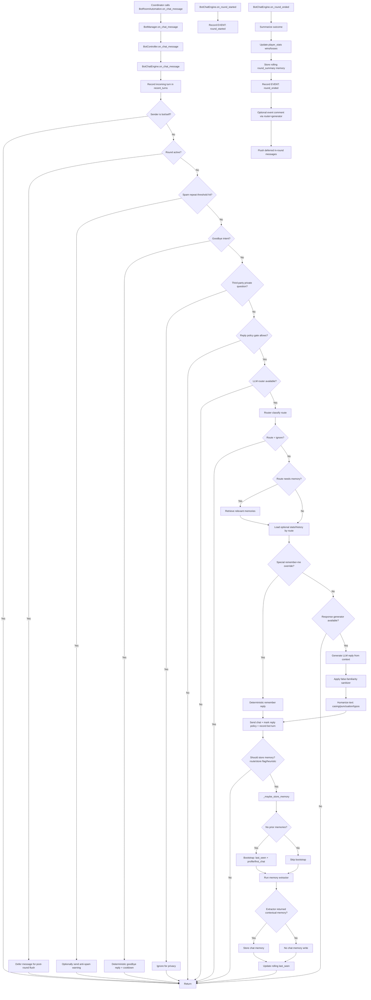

# Bot Logic Flow (Detailed)

This diagram focuses only on the bot-side runtime logic for chat handling.

## Scope

- Includes: `BotRoomAutomation` -> `BotManager` -> `BotController` -> `BotChatEngine`
- Includes router, response generation, memory retrieval/storage, and guardrails.
- Excludes broader websocket/game transport details unless directly needed by bot flow.

## Mermaid Diagram

